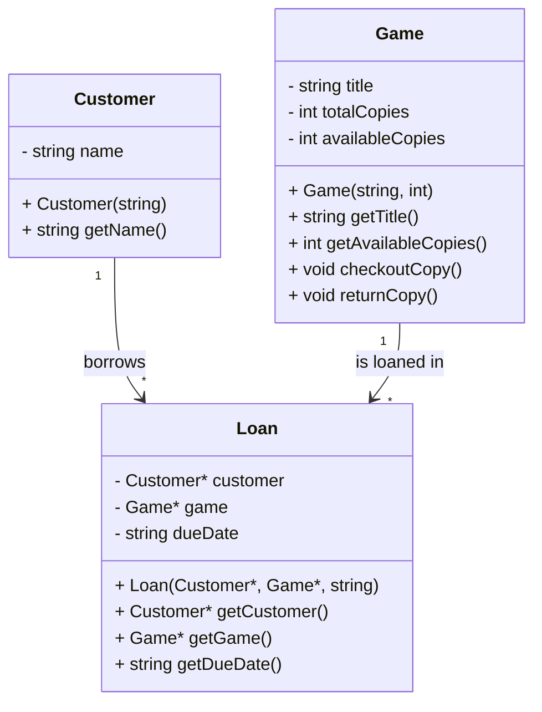

# Board Game Lending Tool Design 

## 1. Program Specification 

This Program is designed to support a local board game cafe to manage its game lending system. This system will track what board games are available, the number of copies for each game and keep a record of what customer has borrowed which game. It will also allow users to check out games to customers and update the record whenever the game is returned. The focus on this design is that it is simple, user friendly and nothing too fancy but perfect for daily use.

## 2. Key Nouns and Verbs

### Nouns:
- Customer
- Game
- Copy
- Due Date
- Loan / Checkout

### Verbs:
- Add game
- List game
- Checkout game 
- Return game
- Track due dates

## 3. Class Declarations

```cpp
class Game {
public:
    Game(std::string title, int totalCopies);
    std::string getTitle() const;
    int getAvailableCopies() const;
    void checkoutCopy();
    void returnCopy();

private:
    std::string title;
    int totalCopies;
    int availableCopies;
};

class Customer {
public:
    Customer(std::string name);
    std::string getName() const;

private:
    std::string name;
};

class Loan {
public:
    Loan(Customer* customer, Game* game, std::string dueDate);
    Customer* getCustomer() const;
    Game* getGame() const;
    std::string getDueDate() const;

private:
    Customer* customer;
    Game* game;
    std::string dueDate;
};

